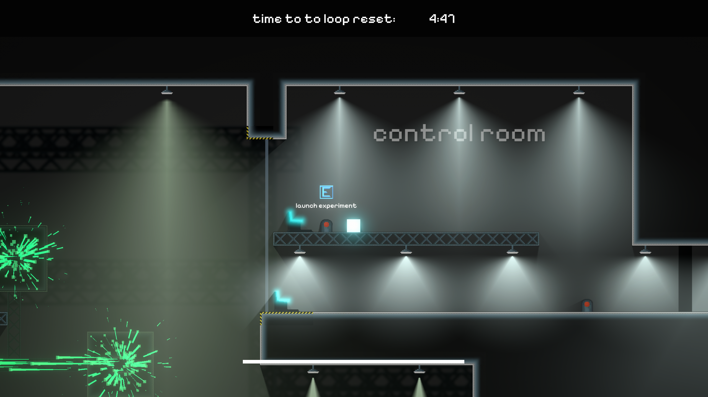

# RegionOfDejaVu

Project files of game made during 72H IZHV game jam

# Controls
| Action  | Keybind |
| ------------- | ------------- |
| Movement  | Arrows  |
| Jump  | z / y  |
| Time leap  | x |
| Focus  | c  |
| Pause  | esc  |

# Used software
- Unity 6 - ( game engine )
- Aseprite - ( all graphics )

# Externaly sourced assets
## Music 
- Time machine sound - Stereo Futuristic Machine Sound by Jagadamba -- https://freesound.org/s/254327/ -- License: Attribution NonCommercial 4.0
- BGM - Music by <a href="https://pixabay.com/users/adamklimtaudio-46175304/?utm_source=link-attribution&utm_medium=referral&utm_campaign=music&utm_content=244271">Adam Klimt</a> from <a href="https://pixabay.com/music//?utm_source=link-attribution&utm_medium=referral&utm_campaign=music&utm_content=244271">Pixabay</a>

